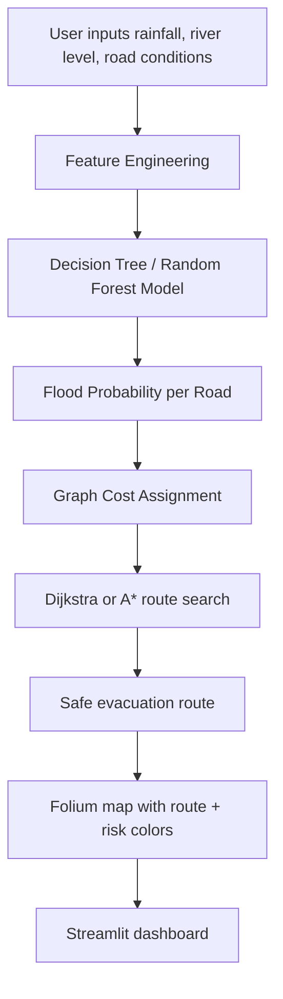
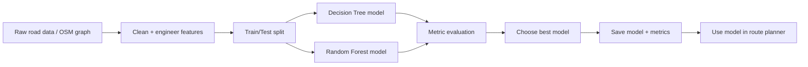
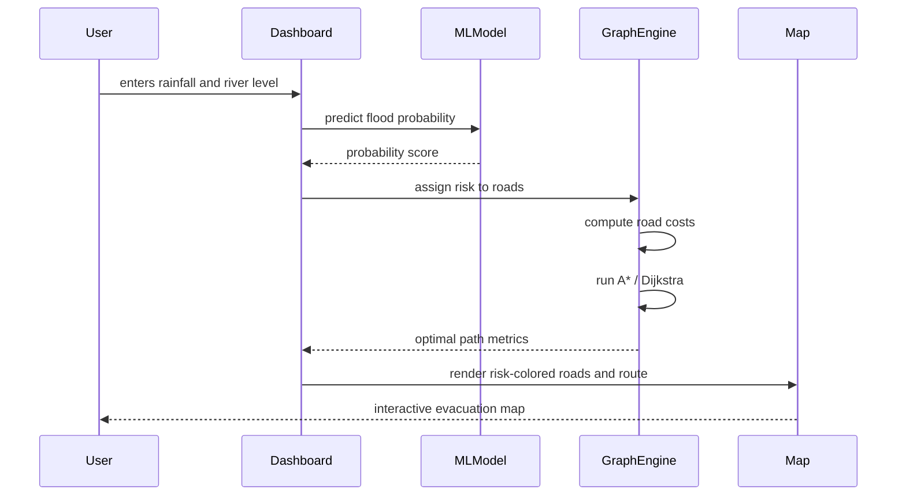

# FloodGuard Lite

AI-Based Flood Evacuation Route Planner

FloodGuard Lite is a compact, local, proof-of-concept system for an AI class project. It combines machine learning and graph-based route planning to estimate flood risk on roads and recommend safer evacuation routes during simulated flood conditions.

The goal is not to build a production disaster response platform. Instead, it demonstrates core AI and software engineering ideas in a small, understandable, and runnable project:

- supervised learning for classification
- feature engineering and evaluation
- graph representation and shortest-path search
- flood-aware cost functions
- interactive map visualization
- dashboard application with Streamlit

---

## Table of Contents

1. Project Overview
2. Why This Project Exists
3. Architecture Summary
4. Repository Structure
5. Environment Setup
6. Installation
7. Data and Model Workflow
8. Running the Project
9. Using the Dashboard
10. Machine Learning Details
11. Routing Details
12. How Everything Connects
13. Troubleshooting
14. Future Improvements

---

## 1. Project Overview

FloodGuard Lite models a small road network and predicts whether each road is likely to flood under a given scenario. It uses environmental input such as:

- rainfall
- river level
- elevation
- distance from river
- road type
- historical flood frequency

The system then:

1. scores each road segment with a flood probability
2. assigns a cost to each road using both distance and flood risk
3. computes the safest route to a shelter or destination
4. renders the result on an interactive Folium map

This is a practical AI demonstration where prediction and decision-making are both included in the same pipeline.

---

## 2. Why This Project Exists

This project is designed as a teaching project for learning:

- machine learning concepts
- supervised classification
- probability estimation
- model evaluation
- graph representation in routing
- heuristic search and shortest path algorithms
- decision support with visualization

The system intentionally uses a small area, not a citywide or national system. The aim is educational clarity rather than operational realism.

---

## 3. Architecture Summary

The project has two major pillars:

### A. Machine learning pillar

Data is converted into engineered features, then a classifier predicts the probability that a road segment floods. The project compares:

- Decision Tree
- Random Forest

The training code evaluates:

- accuracy
- precision
- recall
- F1 score
- confusion matrix

### B. Routing pillar

The road network is represented as a graph:

- nodes = intersections
- edges = roads
- edge attributes = distance, road type, flood probability, and cost

Then route search is performed using:

- Dijkstra
- A*

A* usually performs fewer node expansions because it uses directionality toward the destination.

---

## 4. Repository Structure

```text
FloodGuard/
├── dashboard/
│   ├── __init__.py
│   ├── map_builder.py
│   └── streamlit_app.py
├── data/
│   ├── __init__.py
│   ├── generate_dataset.py
│   └── processed/
│       └── velachery.graphml
├── models/
│   ├── __init__.py
│   ├── flood_model.joblib
│   └── train_model.py
├── reports/
│   ├── demo_map.html
│   ├── figures/
│   └── metrics.json
├── routing/
│   ├── __init__.py
│   ├── algorithms.py
│   ├── cost.py
│   ├── graph_builder.py
│   ├── risk.py
│   └── shelters.py
├── tests/
│   ├── __init__.py
│   ├── test_phase4.py
│   └── test_routing.py
├── utils/
│   ├── __init__.py
│   ├── config.py
│   └── features.py
├── .gitignore
├── requirements.txt
├── main.py
├── README.md
└── assets/
```

---

## 5. Environment Setup

### Prerequisites

You need:

- Python 3.10 or 3.12
- Git
- a local terminal
- internet access for fetching the OSM graph on first run

### Create a virtual environment

```bash
cd /path/to/FloodGuard
python3 -m venv .venv
source .venv/bin/activate
```

On Windows PowerShell:

```powershell
cd C:\path\to\FloodGuard
python -m venv .venv
.\.venv\Scripts\Activate.ps1
```

---

## 6. Installation

Install the required Python dependencies:

```bash
pip install -r requirements.txt
```

The project dependencies include:

- pandas
- numpy
- scikit-learn
- matplotlib
- joblib
- networkx
- osmnx
- folium
- streamlit
- streamlit-folium

If you want to check the dependency list directly, look in [requirements.txt](requirements.txt).

---

## 7. Data and Model Workflow

### Step 1: Generate or prepare data

The project includes a synthetic data generator and a processed graph. You can generate the dataset using:

```bash
python -m data.generate_dataset
```

This creates the road-segment dataset used by the training pipeline.

### Step 2: Train the model

```bash
python -m models.train_model
```

This does the following:

- loads training data
- drops invalid or duplicated rows
- performs feature engineering
- splits into train/test sets
- tunes Decision Tree and Random Forest models
- evaluates on accuracy, precision, recall, F1, and ROC AUC
- saves the best model to `models/flood_model.joblib`
- saves evaluation metrics to `reports/metrics.json`

### Step 3: Build a demo route map

```bash
python -m dashboard.map_builder
```

This creates the demo Folium HTML file in:

```text
reports/demo_map.html
```

---

## 8. Running the Project

### Run the Streamlit app

From the repository root:

```bash
streamlit run main.py
```

Then open the local URL shown in the terminal.

### Run the map builder directly

```bash
python -m dashboard.map_builder
```

This is useful for generating the map without the dashboard.

### Run the tests

```bash
python -m unittest tests.test_routing -v
python -m unittest tests.test_phase4 -v
```

Or run both together:

```bash
python -m unittest tests.test_routing tests.test_phase4 -v
```

---

## 9. Using the Dashboard

The app has four pages:

### Home

- explains the project idea
- gives a conceptual overview
- introduces the machine learning and routing pipeline

### Flood Prediction

This page lets the user input:

- rainfall
- river level
- elevation
- distance from river
- historical flood frequency
- road type

Then it predicts flood probability for a road segment.

### Route Planner

This page allows the user to:

- choose a start node
- choose a destination node
- define rainfall and river level for the scenario
- set the flood-risk weight

The system then:

- computes flood probability on the graph
- applies flood-aware costs
- runs A* for the safest route
- compares against a plain distance-based route
- displays the results on an interactive map

### Analytics

This page shows:

- model evaluation table
- confusion matrix plots
- algorithm comparison metrics

---

## 10. Machine Learning Details

### Why Decision Tree and Random Forest?

These algorithms were chosen because they are:

- easy to explain
- good for small tabular datasets
- naturally suited to structured environmental features
- effective for classification tasks like flood risk prediction

### Decision Tree advantages

- easy to visualize
- interpretable
- fast to train

### Decision Tree disadvantages

- may overfit
- can be unstable on noisy data

### Random Forest advantages

- more robust than a single tree
- reduces variance
- handles non-linear relationships better

### Random Forest disadvantages

- less interpretable than a single decision tree
- training is a bit heavier computationally

### Model features

The model uses a feature vector that includes:

- rainfall_mm
- river_level_m
- elevation_m
- distance_from_river_m
- historical_flood_freq
- engineered features like river exposure and proximity
- one-hot encoded road type fields

### Output

The final prediction is a probability in the range:

```text
0.0 to 1.0
```

A value closer to 1 means the road is more likely to flood.

---

## 11. Routing Details

The graph is built from a road network where:

- nodes = intersections
- edges = road segments
- weight = cost of traversing a road

The cost function combines:

- distance
- flood probability
- configurable flood weight

The project uses the following logic conceptually:

```text
Cost = distance + flood_weight × flood_risk
```

This makes the route planner prefer routes that are safer, even if they are slightly longer.

### Dijkstra

Dijkstra guarantees the shortest path when the cost function is non-negative. It is dependable and mathematically sound.

### A*

A* adds a heuristic estimate of the remaining distance to the destination. This helps the algorithm focus on promising routes instead of exploring all possible nodes.

### Why A* usually performs better here

A* often expands fewer nodes than Dijkstra because it uses directional guidance toward the destination. In road networks, that can save a lot of computation while still finding an optimal route when the heuristic remains admissible.

---

## 12. How Everything Connects

Below is the project pipeline in flowchart form:



This shows the full decision-making loop:

- model predicts risk
- risk affects travel cost
- routing selects the best evacuation route
- UI shows the answer visually

---

## 13. Data Flow



This is the structure used for the AI training loop.

---

## 14. System Workflow



This is the user-level interaction pattern.

---

## 15. Typical Use Cases

### Example 1: Predict a flood risk

- open the Flood Prediction page
- set rainfall to 180 mm and river level to 3.5 m
- click Predict Flood
- inspect the risk probability and classification output

### Example 2: Compute an evacuation route

- open Route Planner
- choose start and destination nodes
- adjust flood weight
- click the route computation flow in the app
- inspect the recommended route on the map

### Example 3: Review model quality

- open Analytics
- compare Decision Tree and Random Forest metrics
- inspect confusion matrices and algorithm performance

---

## 16. Troubleshooting

### Problem: missing package errors

Run:

```bash
pip install -r requirements.txt
```

### Problem: model file not found

Train the model first:

```bash
python -m models.train_model
```

### Problem: route planner fails because graph data is unavailable

The project gracefully falls back to a synthetic grid graph if the OSM dataset cannot be downloaded. This keeps the project usable in local or classroom environments.

### Problem: Folium shows a warning about tiles

This warning is usually non-fatal. The map still renders. It may be caused by CartoDB basemap licensing changes, but the app remains functional for demonstration purposes.

### Problem: Streamlit does not open locally

Check the terminal output for the exact URL and port. It typically runs on:

```text
http://localhost:8501
```

---

## 17. Future Scope

The project can be extended in several ways:

- add real DEM data for elevation from a public source
- integrate real flood and rainfall data
- include actual shelter coordinates from OpenStreetMap
- compare more algorithms such as XGBoost or logistic regression
- add time-varying flood risk simulation
- support multi-criteria route optimization with risk, distance, and time

This is a good academic prototype because it keeps the problem small, understandable, and open to extension.

---

## 18. Summary

FloodGuard Lite is a complete learning project that demonstrates how AI and routing work together in a practical scenario. The project uses:

- supervised classification for flood probability estimation
- graph search for safe route planning
- interactive visualization for explainability
- a simple local dashboard for experimentation

It is intentionally modest, but it is designed to show the full technical workflow from data to decision-making.

If you want to continue the project, the next logical step would be to add more realistic data, improve the training metrics, and compare more strategies for flood-risk estimation.
